## タイピング練習用キーボード基板 Typing Haptic Trainer (Prototype)

2025.11.23
基板を新しくしました！作った基板にArduino Nano Everyを組み込みました。
I made a new PCB and installed an Arduino Nano Every on it.

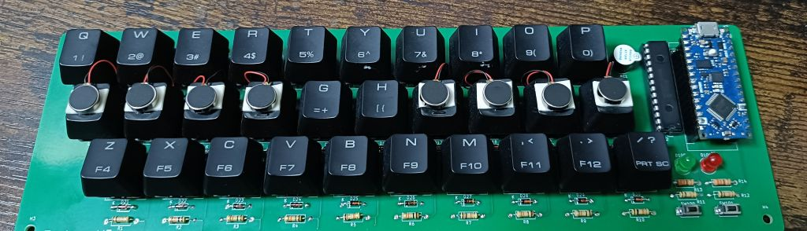

このリポジトリは回路・プログラミング初学者の学習用です。あたたかく見守っていただけると嬉しいです。

これは、プログラミングや回路の初心者である私が、自分なりに学びながら作ってみた実装基板です。  
8つのキーに振動する部品を付け、目で確認しなくてもどこを押せば良いかがわかる機能を目指しました。
公開しようと思ったきっかけは、似たようなアイデアのタイピング練習機を見つけることができなかったためです。

このリポジトリでは、タイピング練習を目的としたキーボード基板の設計データを公開しています。  
基板はKiCad 9.0で設計されています。振動するキー順番を変更するには、Arduinoのスケッチを編集する必要があります。

ただし、現在はアイデア段階であり、完全な完成品ではありません。今後の改善や追加機能に関しては更新を行う予定です。

This repository is for beginners who are learning circuits and programming.
I’d be happy if you could kindly support it.

This is a keyboard I made while learning programming and circuits by myself.
I am still a beginner, but I tried my best to build it.

I added small parts that can vibrate to 8 keys.
This way, you can feel which key to press without looking.

I decided to share this because I couldn't find a similar typing practice device online.

In this repository, I show the design data for this keyboard.
I made the design using KiCad 9.0.
If you want to change the order of the vibrating keys, you need to change the Arduino program.

Please note that this is still just an idea, not a finished product.
I want to improve it and add more features in the future.

---

## 特徴

- 10列、3段のキー(計30個)による練習用構成
- リセットスイッチ付き
- Cherry MX対応
- Arduino nano everyで完璧ではありませんが、一応動作確認済みです (後継機のモデルは動作未確認)
- KiCad 9.0で基板設計
- 基板サイズ：約261.1mm × 81.5mm
- 電源：Arduino nano every経由でのUSB給電

This is a practice keyboard layout with 30 keys, arranged in 10 columns and 3 rows.
It includes a reset switch. It's compatible with Cherry MX switches. I've confirmed it works with the Arduino nano every, although it's not perfect. I haven't tested it with newer Arduino models. The circuit board was designed using KiCad 9.0. The board size is about 261.1mm × 81.5mm, and it's powered by USB through the Arduino nano every.

どの段のキーを押せば良いかを、3段階のブザー音で教えるためのコードを加筆修正しました。上の段ならば3回鳴り、下の段ならば１回鳴り、真ん中の段なら２回鳴るという仕組みにしました。振動モーターがないキーの場合は、振動する長さを変えて位置を知らせるようにしました。

I changed the code to use three kinds of buzzer sounds to tell the user which row of keys to press.
If the key is on the top row, the buzzer beeps three times.
If the key is on the bottom row, it beeps one time.
If the key is on the middle row, it beeps two times.
For keys that do not have a vibration motor, the device changes the length of the vibration to show the position.

---

## ファイル構成

~~~

TypingTrainer/
    ├── TYPING-TRAINER-V5-2025-10-13_115341/ # KiCad設計ファイル
    ├── TYPING-TRAINER-V5.1.zip # ガーバーデータ（基板製造用）
    ├── TrainerV5active/ # Arduinoスケッチ
    ├── images/ # 写真・完成図
    ├── docs/ # 部品表
    └── README.md # このファイル

~~~

---

## 完成イメージ、回路図、動作の様子

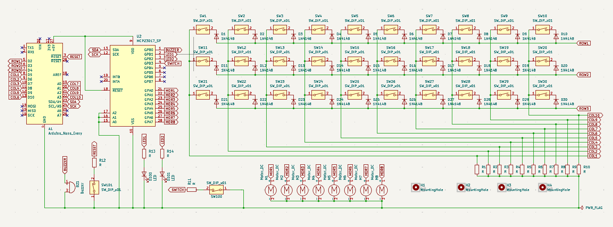

[動作の様子](images/working.mp4)

[モーターの動き](images/shaker.mp4)

---

## 使い方
1. ガーバーファイルをPCBwayなどで製造依頼
2. 回路図などを見ながら部品を実装
3. Arduino nano everyをUSBケーブルでPCと接続
4. PCからArduinoへ、ファームウェアを書き込み

---

## 必要部品

| Value               | Reference      | Qty | 備考                                           | 画像 |
|---------------------|----------------|-----|------------------------------------------------|------|
| Arduino Nano Every  | A1             | 1   | マイクロコントローラー（ソケットピン経由で実装） |  |
| Buzzer              | BZ1            | 1   | ブザー                                         | 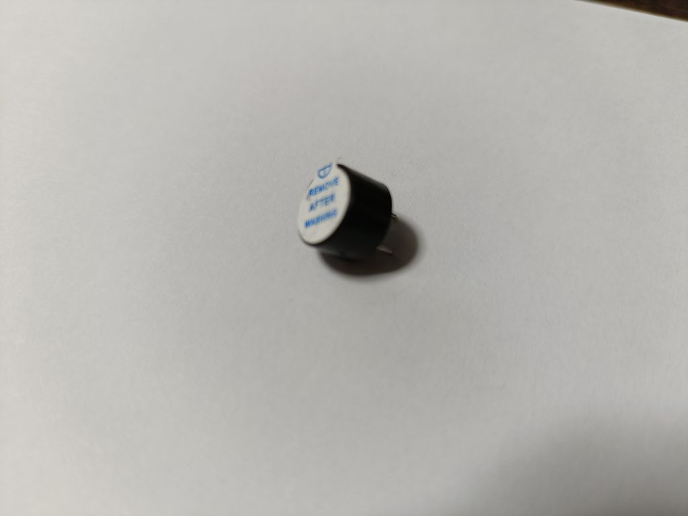 |
| 1N4148              | D1 〜 D30      | 30  | スイッチのマトリックス用ダイオード             | 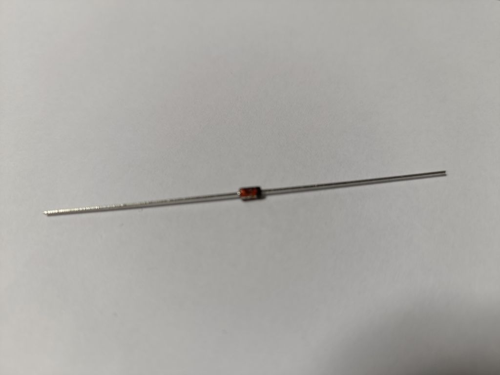 |
| LED                 | D100, D101     | 2   | インジケーターLED                              | 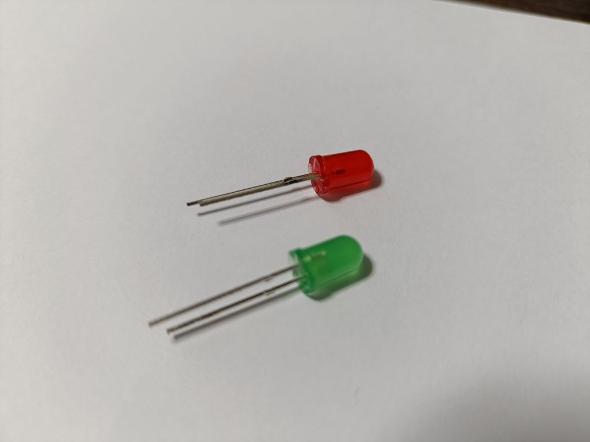 |
| Motor DC            | M1 〜 M8       | 8   | DCモーター                                     | 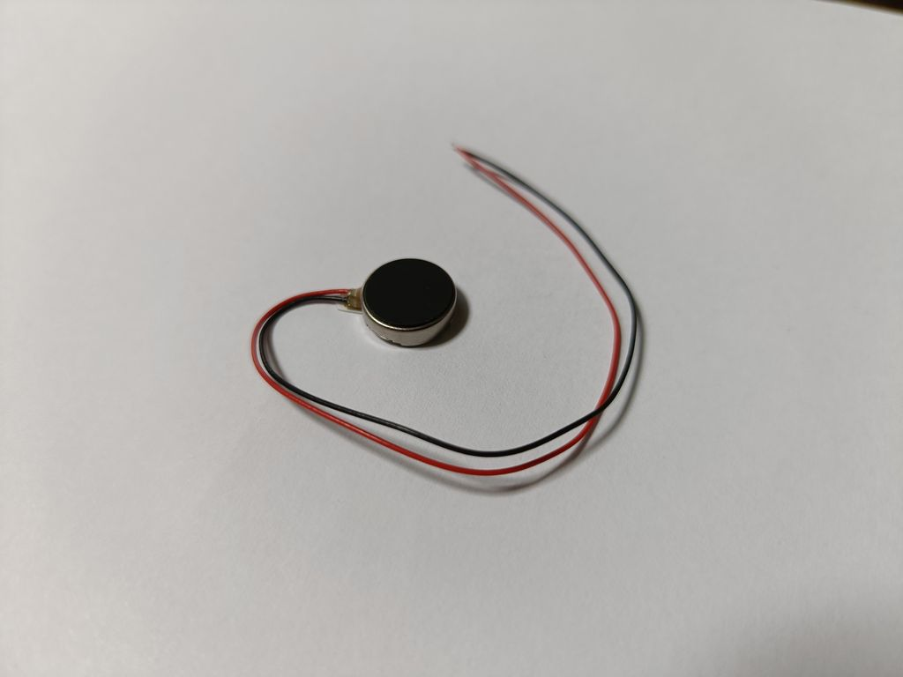 |
| 10k                 | R1 〜 R12      | 12  | 抵抗（10kΩ）                                   | 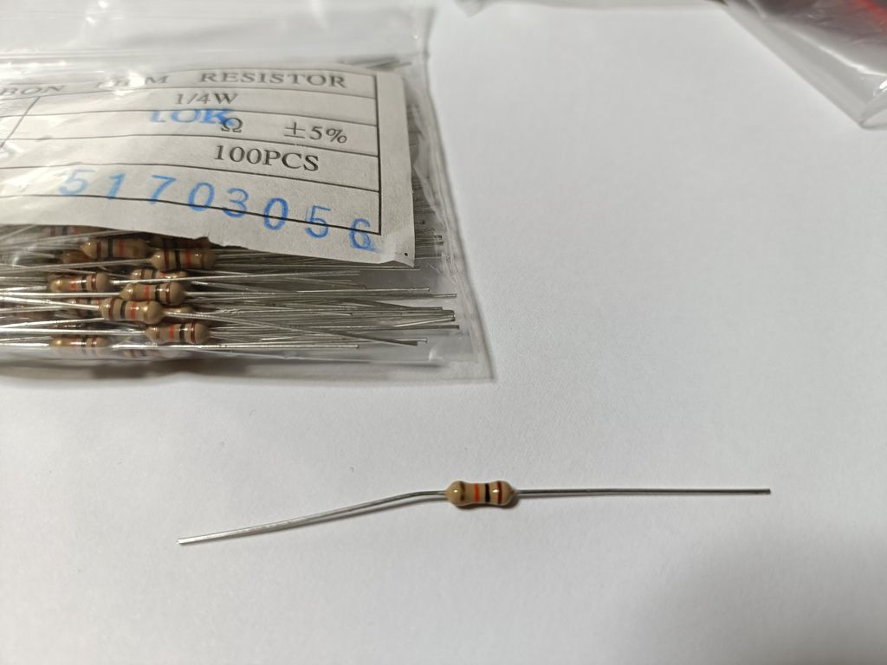 |
| 330                 | R13, R14       | 2   | 抵抗（330Ω, LED電流制限用）                    | 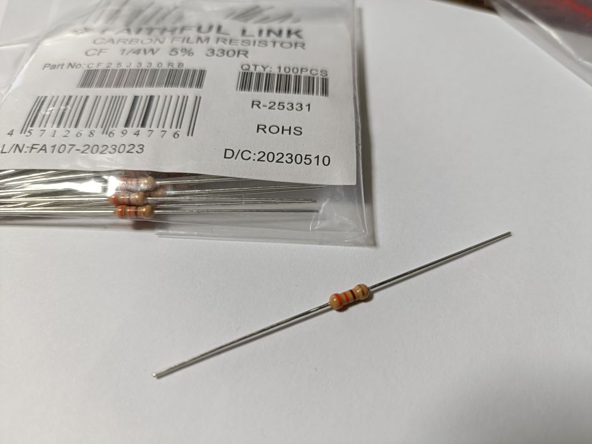 |
| Cherry MX Switch    | SW1 〜 SW30    | 30  | Cherry MX互換キースイッチ(キーキャップはお好みで)                      | 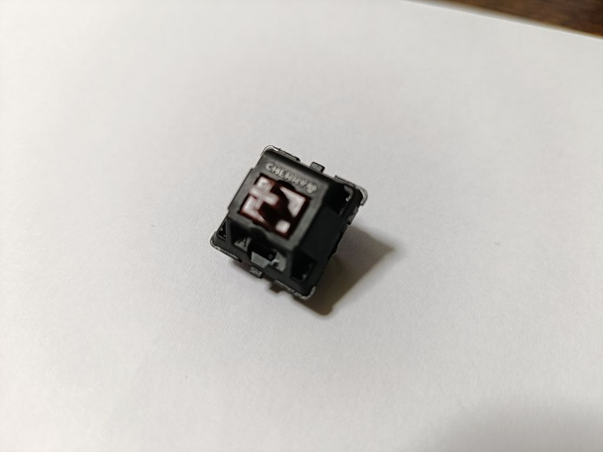 |
| 2pin Button         | SW100, SW101   | 2   | 2ピンのタクトスイッチなど                      | 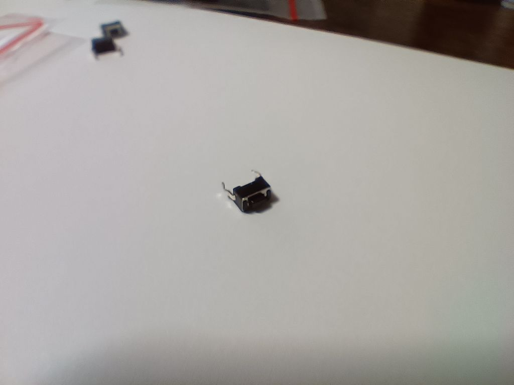 |
| MCP23017_SP         | U2             | 1   | I/Oエキスパンダー（ICソケットの上に実装）      | 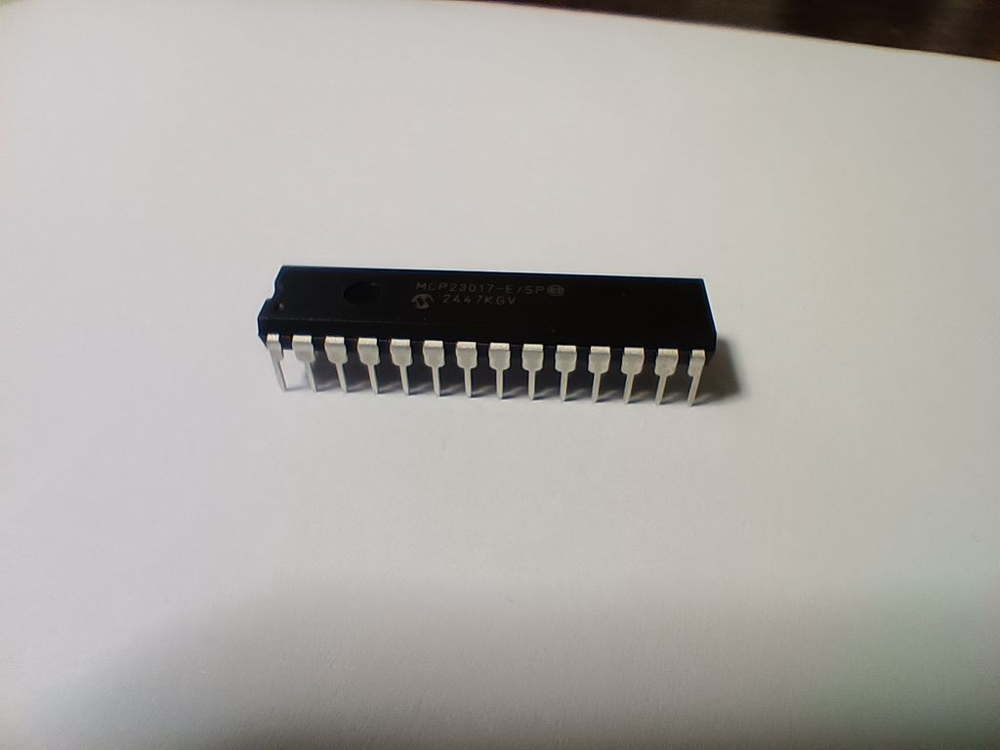 |

---

## KiCad情報

- KiCad バージョン: 9.0
- 古いバージョンでは一部ファイルが開けない可能性があります。
- 最新バージョンでの動作は未確認です。

---

## ライセンス

この基板デザインは MIT ライセンスで公開しています。  

---

## よくある質問

準備中
**Q. ？**  
A. 

---

## 注意事項

- 初心者が学びながら作ったものなので、不完全な点もあるかもしれません。
- Arduinoスケッチの一部のコード作成に、生成AI（ChatGPT）を補助的に活用しました。

---

## Special Thanks

- ネット上のチュートリアルや電子工作記事の皆さま

