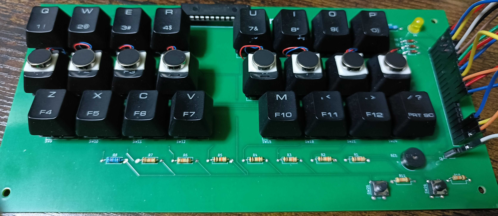

## タイピング練習用キーボード基板

これは、プログラミングや回路の初心者である私が、自分なりに学びながら作ってみた実装基板です。  
8つのキーに振動する部品を付け、目で確認しなくてもどこを押せば良いかがわかる機能を目指しました。
公開しようと思ったきっかけは、似たようなアイデアのタイピング練習機を見つけることができなかったためです。

このリポジトリでは、タイピング練習を目的としたキーボード基板の設計データを公開しています。  
基板はKiCad 8.0で設計されています、基板上に部品を実装し、Arduino Uno R3に接続すれば使えるようになっています。
振動するキー順番を変更するには、Arduinoのスケッチを編集する必要があります。
ただし、現在はアイデア段階であり、完全な完成品ではありません。今後の改善や追加機能に関しては更新を行う予定です。

---

## 特徴

- 8列、3段のキー(計24個)による練習用構成
- リセットスイッチ、段の変更スイッチ機能付き
- Cherry MX対応
- Arduino Uno R3で完璧ではありませんが、一応動作確認済みです (後継機のモデルは動作未確認)
- KiCad 8.0で基板設計
- 基板サイズ：約215.9mm × 104.1mm
- 電源：Arduino Uno R3経由でのUSB給電

---

## ファイル構成

~~~

TypingTrainer/
    ├── TYPING-TRAINER-V4/ # KiCad設計ファイル
    ├── TYPING-TRAINER-V4.zip # ガーバーデータ（基板製造用）
    ├── TrainerV4_h-custom/ # Arduinoスケッチ
    ├── images/ # 写真・完成図
    ├── docs/ # 作成手順など
    └── README.md # このファイル

~~~

---

## 完成イメージ

---

## 使い方
1. ガーバーファイルをPCBwayなどで製造依頼
2. 回路図などを見ながら部品を実装
3. Arduino Uno R3と基板をジャンパワイヤで接続後、ArduinoをUSBケーブルでPCと接続
4. PCからArduinoへ、ファームウェアを書き込み

---

## 必要部品

| パーツ                   | 型番 / 種類                  | 数量 | 備考         |
| :----------------------- | :--------------------------- | :--- | :----------- |
| マイコン                 | Arduino Uno R3               | 1個  |              |
| USBケーブル              | USB-A to USB-B               | 1本  | PC接続用     |
| I/Oエキスパンダー        | MCP23017                     | 1個  |              |
| ICソケット               | 28ピン スリム300milタイプ    | 1個  | IC直付けなら不要 |
| メカニカルスイッチ       | Cherry MX互換                | 24個 |              |
| キーキャップ             | 上記スイッチ対応のもの        | 24個 |              |
| ダイオード               | 1N4148                       | 3個  | キーマトリクス用 |
| 抵抗                     | 10kオーム                    | 10個 |              |
| 抵抗                     | 330オーム                    | 1個  |              |
| LED (5mm)                | 色はお好みで                 | 1個  |              |
| タクトスイッチ           |                              | 2個  |              |
| パッシブ電子ブザー       |                              | 1個  | \*1          |
| 振動モーター             |                              | 8個  |              |
| コネクタ用のピンソケット | 20pin                        | 1個  |              |
| コネクタ用のピンソケット | 2pin                         | 1個  |              |
| ジャンパ線              | 10cm～20cm                    | 20本くらいあれば     |                   

*1 ブザーのフットプリント参考URL https://jp.sameskydevices.com/product/resource/pcbfootprint/cmt-9648-85t

---

## KiCad情報

- KiCad バージョン: 8.0
- 古いバージョンでは一部ファイルが開けない可能性があります。
- 最新バージョンでの動作は未確認です。

---

## ライセンス

この基板デザインは MIT ライセンスで公開しています。  

---

## よくある質問

準備中
**Q. ？**  
A. 

---

## 注意事項

- 初心者が学びながら作ったものなので、不完全な点もあるかもしれません。
- Arduinoスケッチの一部のコード作成に、生成AI（ChatGPT）を補助的に活用しました。

---

## Special Thanks

- ネット上のチュートリアルや電子工作記事の皆さま

---

## お問い合わせ

ご意見・アドバイス・利用報告などは、GitHubのIssueへお願いします。

